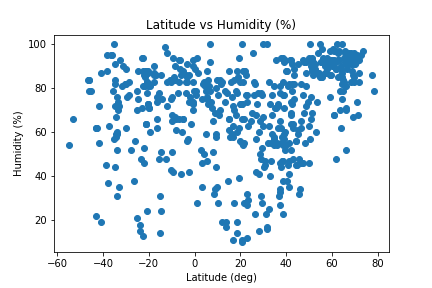
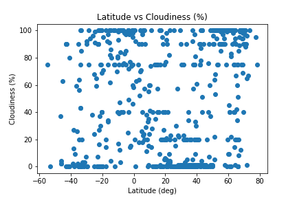
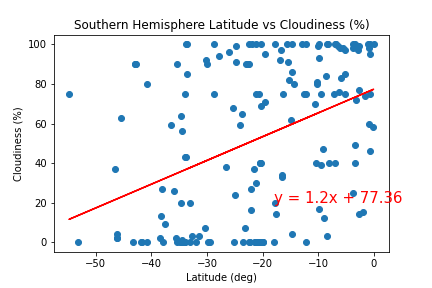

# Python-API-Challenge - What's the Weather Like?

## Background

We will use a Python script to visualize the weather of 500+ cities across the world of varying distance from the equator. To accomplish this, you'll be utilizing a [simple Python library](https://pypi.python.org/pypi/citipy), the [OpenWeatherMap API](https://openweathermap.org/api), and a little common sense to create a representative model of weather across world cities.

## WeatherPy

### Analysis

#### Import Dependencies
	
	# Dependencies and Setup
	import json
	import requests
	import pandas as pd
	import matplotlib.pyplot as plt
	from citipy import citipy
	import numpy as np
	from api_keys import weather_api_key

#### Generate Cities List

	latitudes = np.random.uniform(-90,90,1500)
	longitudes = np.random.uniform(-180, 180, 1500)
	cities =[]
	coordinates = []
	coordinates = zip(latitudes, longitudes)
	for coordinate_pair in coordinates:
	     lat, lon = coordinate_pair
	     city = citipy.nearest_city(lat, lon).city_name
	     if city not in cities:
       		cities.append(city)

#### Perform API Calls

	# Set url for API call
	url = "http://api.openweathermap.org/data/2.5/weather?"
	units = "imperial"
	# Set up array
	city_data = []
	# Loop through cities list and get weather data
	count=1
	set=1
	for City in cities:
	    query_url = f"{url}appid={weather_api_key}&units={units}&q={City}"
	    print(f"Processing Record {count} of Set {set} | {City}")
	    weather = requests.get(query_url).json()
	    if count==50:
	            count = 1
	            set = set+1
	    else:
	            count = count +1  
	    try:
	        temp = weather['main']['temp']
	        humidity = weather['main']['humidity']
	        cloudiness = weather['clouds']['all']
	        wind = weather['wind']['speed']
	        lat = weather['coord']['lat']
	        lon = weather['coord']['lon']
	        name = weather['name']
	        city_data.append({"City":name, "Latitude":lat,"Longitude":lon,"Temp (F)":temp, "Humidity (%)":humidity,"Cloudiness (%)":cloudiness, "Wind Speed (mph)":wind})
       
	    except:
	        print("City not found. Skipping...")
	        pass

	print("----------------------------")
	print("Data Retrieval Complete")
	print("----------------------------")

#### Convert Raw Data Into DataFrame and save in a csv file
	city_data = pd.DataFrame(city_data)
	city_data.to_csv("Weather_City_Data.csv", encoding="utf-8", index=False, header=True)

#### Clean the data

	# Check for cities with Humidity greater than 100
	humid100 = city_data[(city_data['Humidity (%)']>100)].index

	# Make a new DataFrame equal to the city data to drop all humidity outliers by index.
	clean_city_data = city_data.drop(humid100, inplace=False)

### Plotting the Data

#### Latitude vs Temperature

#### Latitude vs. Humidity Plot

#### Latitude vs. Cloudiness Plot

#### Latitude vs. Wind Speed Plot

### Linear Regression

#### Northern Hemisphere - Max Temp vs. Latitude Linear Regression

* The correlation between temperature and latitude for the northern hemisphere is -0.9
* The final r-squared value is 0.81

#### Southern Hemisphere - Max Temp vs. Latitude Linear Regression

!SouthernHemisphere Temp v Latitude](WeatherPy/Plots/Temp_v_Latitude_Southern_Hemisphere.png)

* The correlation between temperature and latitude for the southern hemisphere is 0.74
* The final r-squared value is 0.55

The linear regression model of the temperature compared to its latitudinal position in the northern hemisphere shows a very strong negative correlation between the two variables. About 81% of the variability in temperature can be attributed to its latitudinal position. In the southern hemisphere, there is a strong positive correlation between the latitudinal position and temperature reading. Only 55% of the variability can be attributed to its latitudinal position. Both graphs show that as you move closer to the equator, temperatures increase.

#### Northern Hemisphere - Humidity vs. Latitude Linear Regression

* The correlation between humidity and latitude for the northern hemisphere is 0.42
* The final r-squared value is 0.17

#### SouthernHemisphere - Humidity vs. Latitude Linear Regression

* The correlation between humidity and latitude for the southern hemisphere is 0.13
* The final r-squared value is 0.02

The linear regression model of the humidity compared to its latitudinal position in the northern hemisphere shows a strong positive relationship. Where as the relationship between humidity and position in the southern hemisphere is negligable.

#### Northern Hemisphere - Cloudiness vs. Latitude Linear Regression

* The correlation between cloudiness and latitude for the northern hemisphere is 0.29
* The final r-squared value is 0.08

#### Southern Hemisphere - Cloudiness vs. Latitude Linear Regression

* The correlation between cloudiness and latitude for the southern hemisphere is 0.41
* The final r-squared value is 0.16

The linear regression model of the cloudiness compared to its latitudinal position in the northern hemisphere shows a weak positive relationship. In the southern hemisphere, there is a strong positive relationship between the cloudiness and position.

#### Northern Hemisphere - Wind Speed vs. Latitude Linear Regression

* The correlation between wind speed and latitude for the northern hemisphere is 0.09
* The final r-squared value is 0.01

#### Southern Hemisphere - Wind Speed vs. Latitude Linear Regression

* The correlation between humidity and latitude for the southern hemisphere is -0.03
* The final r-squared value is 0.0

The linear regression model for wind speed compared to its latitudinal position shows negligiable correlation in both hemispheres. Wind speed is independent of position.

## VacationPy

### Analysis

#### Setup dependencies and import [Weather_City_Data.csv](WeatherPy/Weather_City_Data.csv)
	# Dependencies and Setup
	import matplotlib.pyplot as plt
	import pandas as pd
	import numpy as np
	import requests
	import gmaps
	import os

	# Import API key
	from api_keys import g_key

	# Read CSV
	CityData = pd.read_csv("../WeatherPy/Weather_City_Data.csv ")

#### Humidity Heatmap

	# Configure gmaps
	gmaps.configure(api_key=g_key)
	# Store latitude and longitude in locations
	locations = CityData[["Latitude", "Longitude"]]
	# Store humidity
	humidity = CityData["Humidity (%)"]
	max = CityData["Humidity (%)"].max()
	# Plot Heatmap
	fig = gmaps.figure()
	# Create heat layer
	heat_layer = gmaps.heatmap_layer(locations, weights=humidity, dissipating=False, 	max_intensity=100,point_radius=1)
	# Add layer
	fig.add_layer(heat_layer)

#### Hotel Map

* Find Places with ideal conditions

	  Ideal = CityData[(CityData["Temp (F)"] > 70) & (CityData["Temp (F)"] < 80) & (CityData["Cloudiness (%)"] == 0) & (CityData["Humidity (%)"]<70) & (CityData["Wind Speed (mph)"]<10)].reset_index()
	  Ideal = Ideal[['City', 'Latitude', 'Longitude','Temp (F)', 'Humidity (%)', 'Cloudiness (%)', 'Wind Speed (mph)']]

* Hit the Google Places API for each city's coordinates

	  # Create array for hotel names
	  hotel = []
	  # Set search parameters
	  radius = 5000
	  target_type = "hotel"
	  base_url = "https://maps.googleapis.com/maps/api/place/nearbysearch/json"
	  for x in range(len(hotel_df)):
	      lat = hotel_df.loc[x]['Latitude']
	      lng = hotel_df.loc[x]['Longitude']
	      coords = f"{lat}, {lng}"
	      params = {"location":coords , "types": target_type,"radius": radius, "keyword": "hotel", "key": g_key}
	      # Search for hotels
	      hotelsearch = requests.get(base_url, params).json()
	      try:
	          hotel.append(hotelsearch["results"][0]["name"])
	      except:
	          hotel.append(np.nan)

* Store the first Hotel result into the DataFrame and plot markers on top of the heatmap.

	  # Using the template add the hotel marks to the heatmap
	  info_box_template = """
	  <dl>
	  <dt>Name</dt><dd>{Hotel Name}</dd>
	  <dt>City</dt><dd>{City}</dd>
	  <dt>Country</dt><dd>{Country}</dd>
	  </dl>
	  """
	  # Store the DataFrame Row
	  # NOTE: be sure to update with your DataFrame name
	  hotel_info = [info_box_template.format(**row) for index, row in hotel_df.iterrows()]
	  locations = hotel_df[["Latitude", "Longitude"]]
	  
	  # Add marker layer ontop of heat map
	  markers = gmaps.marker_layer(locations)
	  fig.add_layer(markers)

